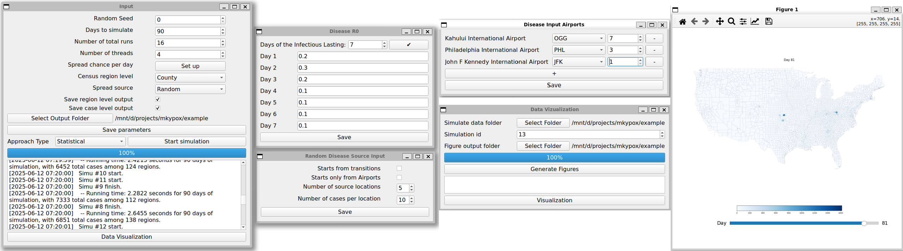
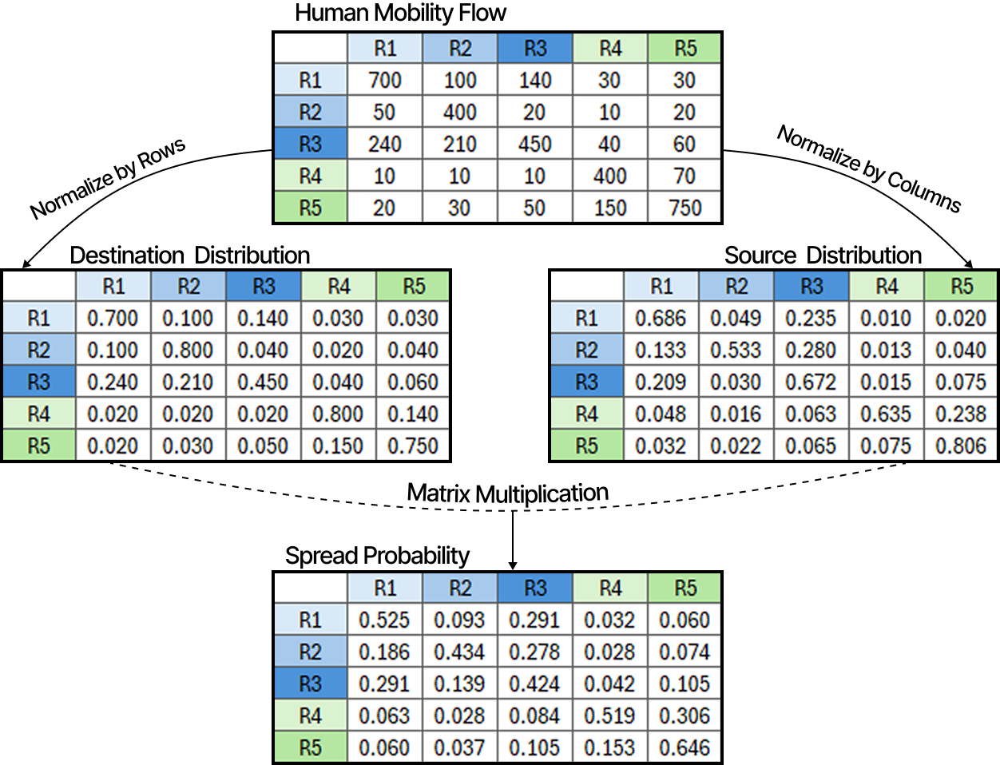
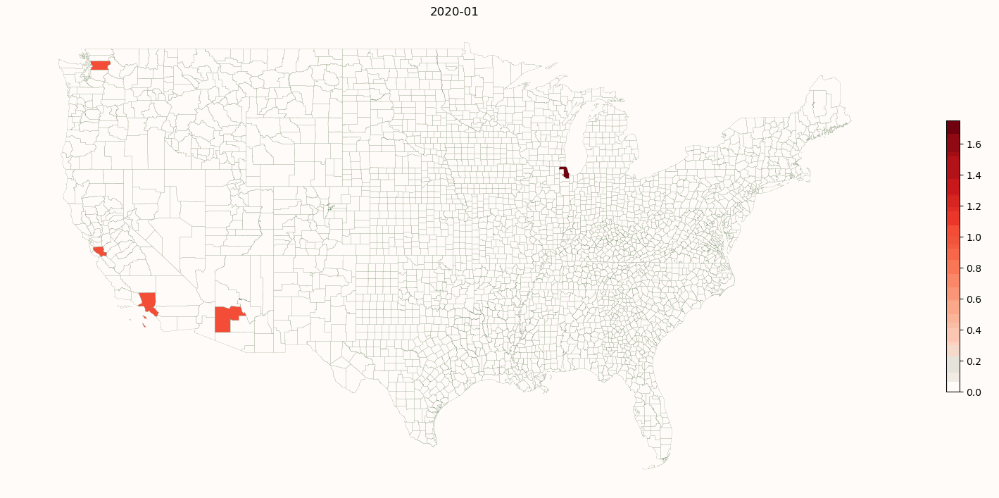

# Overview

This repository is the compartmental infectious disease simulation described in the paper
***"EpiScale: Large-Scale Simulation of Infectious Disease Based on Human Mobility \[Demo\]"*** currently under review.

In this demonstration, we present a **large-scale, compartmental infectious disease spread simulation** framework 
designed to model disease dynamics across the entire United States at three different spatial resolutions: 
220,000+ Census Block Groups (CBGs), 74,000+ Census Tracts, or 3,000+ Counties.

This simulation depends only on [Census data](https://data.census.gov/) and [human mobility data](https://www.deweydata.io/data-partners/advan), 
allowing the spread of disease to be simulated purely from movement patterns without relying on real-world infectious disease data.

## Usage

The simulation is provided with Graphic User Interface, with all windows showing bellow:

After successfully setting up and saving the parameters, a *params* file will exist under *simulation_gui/GUI_params*. 
The subsets of parameters set from each window will also be stored in the same folder.

To run the simulation with GUI, users first need to have the necessary source files, and then after saving the parameters, 
simply select the approach type from *naive* or *statistical* and click on run.

The simulation can also run without GUI. To do so, users need to dive into the *statistical_approach* or *naive_approach* folder and run the simulation with command:
```
python simulation_main.py <path_to_parameter_file>
```

After obtained the simulation outputs, a data visualization tool is also available. From the GUI, users can generate daily disease spread map 
for a selected simulation run, and can easily compare the changes with the slider bar on the visualization window. 
A gif storing figures from each day is created simultaneously in the same figure output folder.

The visualization tool can also run headless by diving into the *data_viz* folder and using the command:
```
python generate_figures.py -data_dir <path_to_simu_output> -simu_id <num_of_simu_run> -figure_dir <path_to_store_figures>
python figure_display.py <path_to_stored_figures>
```

## Source Data
For the ***naive approach***, the simulation requires processed ***flow data***. Due to the policy of Advan, we will not share the CBG level flows.
Users who interested in running this approach on CBG levels would need to subsrcibe the [Advan Patterns](https://www.deweydata.io/data-partners/advan) data.
However, the flow data on Census Tract and County level are available by [***Kang et al.***](https://github.com/GeoDS/COVID19USFlows) in their paper 
***Multiscale dynamic human mobility flow dataset in the U.S. during the COVID-19 epidemic***. 
After obtained the raw flow data, users need to do the preprocessing on their own, as this approach is not our may target.
The sample data preprocessig scripts are available in folder [data_process_scripts](data_process_scripts).

Fot the efficient ***statistical approach***, the simulation is based on a further calculated spread probability matrix from the flow data, 
available in [src_data/spread_probability_top30](src_data/spread_probability_top30). The following is the sample of how to calculate this matrix.



The data processing file is also available in [data_process_scripts](data_process_scripts) for whom interested to run the simulation with a different flow data.

## Scenarios
In the paper we described 2 Scenarios as below.
### Scenario 1
We initialized the disease from **five major airports** (MIA, IAH, PHX, JFK, ORD)
Each with 100 cases initially. These airports are the hypothetical sources of disease input at the early stage of COVID-19

To compare with the real cases:

### Scenario 2
We initialized the disease from the **five largest counties** in Minnesota, namely Hennepin County, Ramsey County, Dakota County, Anoka County, and Washington County. The simulation begins with 100 cases in each selected county.
